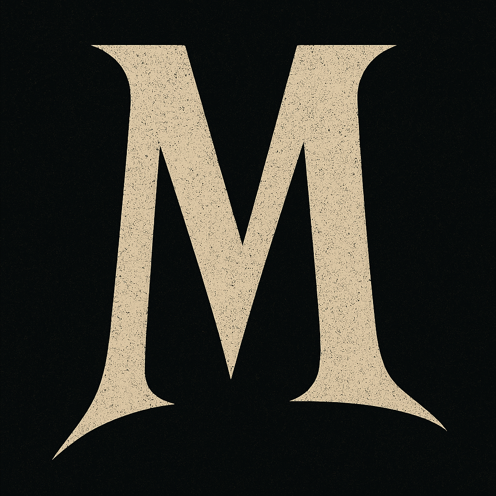

# Murnau - Cinematic Synthesizer

[](https://github.com/jsfillman/murnau/actions/workflows/tests.yml)
[](https://codecov.io/gh/jsfillman/murnau)
[](https://www.python.org/downloads/)
[](LICENSE)
[](https://github.com/psf/black)

A stylish, expressive synthesizer inspired by German Expressionist cinema aesthetics, created with Faust DSP language and controlled through OSC or MIDI.


## Overview

Murnau is a German Expressionist-inspired synthesizer system that combines:

- Faust DSP for high-quality, efficient audio processing
- OSC for flexible parameter control
- MIDI for playing notes and controller integration
- PyQt6 for a stylish, cinematic user interface:

---


---


## Project Structure

```
murnau/
├── src/                    # Source code
│   ├── murnau/            # Main package
│   │   ├── dsp/          # Faust DSP source files
│   │   ├── ui/           # User interface components
│   │   ├── synth/        # Synthesizer control modules
│   │   └── utils/        # Utility modules
│   └── lib/              # External libraries
├── scripts/               # Entry point scripts
│   ├── murnau_ui.py      # UI launcher
│   ├── melody.py         # Melody player
│   └── ramp_test.py      # Ramp tester
├── tests/                 # Test suite
├── docs/                  # Documentation
├── assets/               # Images and resources
├── config/               # Configuration files
├── build/                # Build artifacts (generated)
├── legato_synth.dsp      # Main DSP file (for compilation)
├── start_murnau.sh       # Startup script
├── Makefile              # Build automation
└── requirements.txt      # Dependencies
```

## Components

The system consists of the following core components:

1. **Synthesizer Engine**: Created with Faust DSP language (`legato_synth.dsp`)
   - Monophonic synthesizer with legato capability
   - Four waveform types: Sine, Triangle, Sawtooth, Square
   - Full ADSR envelope control
   - Expressive playing controls

2. **User Interface**: A stylish PyQt6 UI inspired by German Expressionism (`murnau_ui.py`)
   - Direct control of all synthesizer parameters
   - Built-in virtual piano keyboard
   - Integrated MIDI device connection
   - Waveform visualization
   - German Expressionist-inspired design

3. **Control Modules**: Python modules for synthesizer control
   - `melody.py` - Play test melodies
   - `ramp_test.py` - Test frequency ramping

## Installation

1. Clone the repository
2. Install dependencies:
```bash
pip install -r requirements.txt
```

Or install in development mode:
```bash
pip install -e ".[dev]"
```

## Usage

### Quick Start (Recommended)

Simply run the startup script which handles everything automatically:

```bash
./start_murnau.sh
```

This script will:
1. Start JACK audio server (with CoreAudio on macOS)
2. Compile and start the Faust synthesizer
3. Launch the Murnau user interface

### Manual Start

1. **Start JACK** (if not using the script):
   ```bash
   jackd -d coreaudio -r48000 -p512
   ```

2. **Compile and run the synthesizer**:
   ```bash
   faust2jack -osc legato_synth.dsp
   ./legato_synth
   ```

3. **Launch the UI**:
   ```bash
   python scripts/murnau_ui.py
   ```

### Test Scripts

Play a test melody:
```bash
python scripts/melody.py
```

Test frequency ramping:
```bash
python scripts/ramp_test.py
```

Or use the Makefile shortcuts:
```bash
make melody    # Play test melody
make ramp      # Test frequency ramping
```

## Features

### Synthesizer Engine
- **Waveforms**: Sine, Triangle, Sawtooth, Square
- **Envelope**: Full ADSR control for amplitude shaping
- **Legato Mode**: Smooth pitch transitions for connected notes
- **Expression**: Gain control and pitch modulation

### User Interface
- **Stylish Design**: Inspired by German Expressionist cinema
- **Real-time Control**: All parameters accessible via knobs and sliders
- **Virtual Keyboard**: Play notes with mouse or computer keyboard
- **MIDI Integration**: Connect any MIDI controller
- **Visual Feedback**: Animated waveform display

### OSC Control
The synthesizer responds to these OSC messages:
- `/legato_synth/freq` - Note frequency (Hz)
- `/legato_synth/gate` - Note on/off (0-1)
- `/legato_synth/gain` - Output volume (0-1)
- `/legato_synth/attack` - Attack time (0.001-2.0 seconds)
- `/legato_synth/decay` - Decay time (0.001-2.0 seconds)
- `/legato_synth/sustain` - Sustain level (0-1)
- `/legato_synth/release` - Release time (0.01-5.0 seconds)

## Testing

Run the test suite:
```bash
pytest
```

Run with coverage report:
```bash
pytest --cov=src --cov-report=html
```

The project aims for at least 90% test coverage.

## Design Philosophy

Murnau's design is inspired by the visual language of German Expressionist cinema:

- **Stark Contrasts**: Dark backgrounds with bright, angular controls
- **Geometric Forms**: Clean, purposeful shapes that evoke the era
- **Dramatic Lighting**: Gold and amber highlights against shadow
- **Emotional Expression**: Controls that feel alive and responsive



## Requirements

- macOS, Linux, or Windows
- Python 3.8 or higher
- JACK Audio Connection Kit
- Faust compiler (for building from source)

## Troubleshooting

1. **No sound**: Ensure JACK is running and the synthesizer is connected
2. **MIDI not working**: Check MIDI device permissions and connections
3. **OSC timeout**: Verify the synthesizer is running on port 5510

## Contributing

Contributions are welcome! Please feel free to submit issues or pull requests.

## License

[Your license here]

## Credits

Created by [Your name]
Inspired by the cinematic works of F.W. Murnau and the German Expressionist movement.