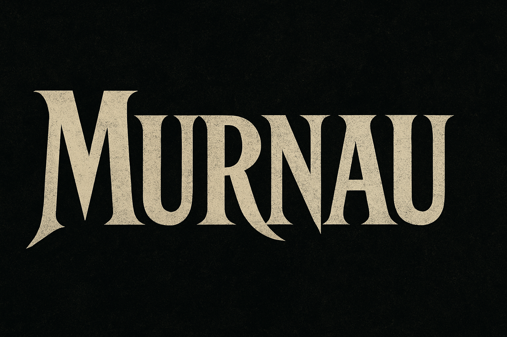
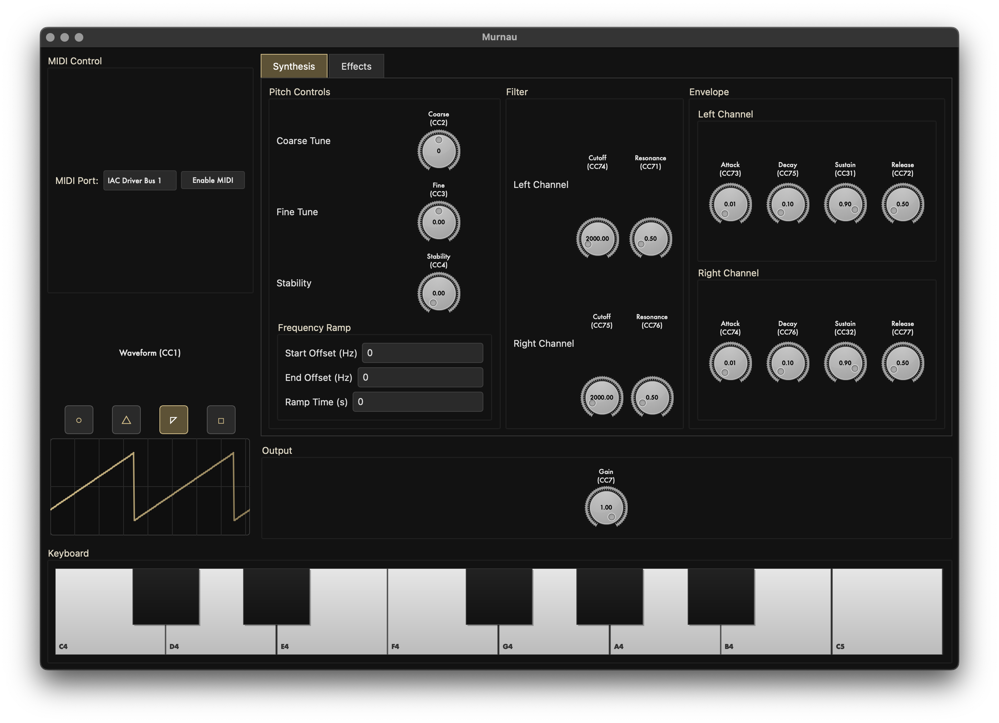

# Murnau - Software Synthesizer

[](https://github.com/jsfillman/murnau/actions/workflows/tests.yml)
[](https://github.com/jsfillman/murnau/actions/workflows/tests.yml)
[](https://www.python.org/downloads/)
[](LICENSE)
[](https://github.com/psf/black)

A monophonic software synthesizer built with Faust DSP and Python, featuring OSC and MIDI control interfaces.



## Overview

Murnau is a software synthesizer that provides:

- Real-time audio synthesis using Faust DSP
- OSC protocol support for remote parameter control
- MIDI input for note triggering and continuous controllers
- Cross-platform GUI built with PyQt6




## Project Structure

```
murnau/
├── src/                    # Source code
│   ├── murnau/            # Main package
│   │   ├── dsp/          # Faust DSP source files
│   │   ├── ui/           # User interface components
│   │   ├── synth/        # Synthesizer control modules
│   │   └── utils/        # Utility modules
│   └── lib/              # External libraries
├── scripts/               # Entry point scripts
│   ├── murnau_ui.py      # UI launcher
│   ├── melody.py         # Melody player
│   └── ramp_test.py      # Ramp tester
├── tests/                 # Test suite
├── docs/                  # Documentation
├── assets/               # Images and resources
├── config/               # Configuration files
├── build/                # Build artifacts (generated)
├── legato_synth.dsp      # Main DSP file (for compilation)
├── start_murnau.sh       # Startup script
├── Makefile              # Build automation
└── requirements.txt      # Dependencies
```

## Components

The system consists of three main components:

1. **DSP Engine** (`legato_synth.dsp`)
   - Faust-based audio synthesis engine
   - Monophonic operation with legato note transitions
   - Four oscillator waveforms: sine, triangle, sawtooth, square
   - ADSR envelope generator
   - Real-time parameter control via OSC

2. **GUI Application** (`murnau_ui.py`)
   - PyQt6-based control interface
   - Real-time parameter adjustment
   - Virtual piano keyboard
   - MIDI device integration
   - Waveform visualization

3. **Utility Scripts**
   - `melody.py` - Automated melody playback
   - `ramp_test.py` - Frequency sweep testing

## Installation

1. Clone the repository
2. Install dependencies:
```bash
pip install -r requirements.txt
```

Or install in development mode:
```bash
pip install -e ".[dev]"
```

## Usage

### Quick Start (Recommended)

Simply run the startup script which handles everything automatically:

```bash
./start_murnau.sh
```

This script will:
1. Start JACK audio server (with CoreAudio on macOS)
2. Compile and start the Faust synthesizer
3. Launch the Murnau user interface

### Manual Start

1. **Start JACK** (if not using the script):
   ```bash
   jackd -d coreaudio -r48000 -p512
   ```

2. **Compile and run the synthesizer**:
   ```bash
   faust2jack -osc legato_synth.dsp
   ./legato_synth
   ```

3. **Launch the UI**:
   ```bash
   python scripts/murnau_ui.py
   ```

### Test Scripts

Play a test melody:
```bash
python scripts/melody.py
```

Test frequency ramping:
```bash
python scripts/ramp_test.py
```

Or use the Makefile shortcuts:
```bash
make melody    # Play test melody
make ramp      # Test frequency ramping
```

## Features

### Audio Engine
- **Oscillator**: Four waveform types (sine, triangle, sawtooth, square)
- **Envelope**: ADSR amplitude envelope with configurable timing
- **Legato**: Smooth frequency transitions between notes
- **Output**: Configurable gain control

### Control Interface
- **GUI**: Real-time parameter control via sliders and knobs
- **Virtual Keyboard**: Mouse-clickable piano interface
- **MIDI**: Hardware controller support with automatic device detection
- **Visualization**: Real-time waveform display

### OSC Protocol
The synthesizer accepts OSC messages on port 5510:
- `/legato_synth/freq` - Frequency in Hz (20-8000)
- `/legato_synth/gate` - Note trigger (0 or 1)
- `/legato_synth/gain` - Output level (0.0-1.0)
- `/legato_synth/attack` - Attack time in seconds (0.001-2.0)
- `/legato_synth/decay` - Decay time in seconds (0.001-2.0)
- `/legato_synth/sustain` - Sustain level (0.0-1.0)
- `/legato_synth/release` - Release time in seconds (0.01-5.0)

## Testing

Run the test suite:
```bash
pytest
```

Run with coverage report:
```bash
pytest --cov=src --cov-report=html
```

Current test coverage: 79%

## System Requirements

- **Operating System**: macOS, Linux, or Windows
- **Python**: 3.8 or higher
- **Audio**: JACK Audio Connection Kit
- **Build Tools**: Faust compiler (for DSP compilation)

## Troubleshooting

### Common Issues

1. **No audio output**
   - Verify JACK audio server is running
   - Check audio device connections in JACK

2. **MIDI not detected**
   - Confirm MIDI device permissions
   - Check device connections and drivers

3. **OSC communication errors**
   - Ensure synthesizer is running on port 5510
   - Verify firewall settings allow local connections

## Contributing

Contributions are welcome. Please:
- Follow the existing code style (Black formatting)
- Include tests for new features
- Update documentation as needed

## License

MIT License - see LICENSE file for details.